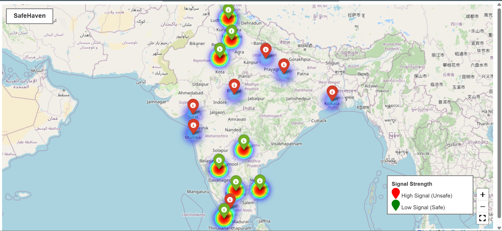

# 🛡️ SafeHaven — AI-powered Wildlife Signal Mapper

**SafeHaven** is a web-based platform that helps identify **safe zones for birds, honeybees, and other pollinators** by mapping **low electromagnetic (EM) signal areas**.  
It enables users to explore safe regions using an interactive map + heatmap and also contribute signal data through the platform. 

---

## 🎮 Demo

### ✅ Heatmap View

---

## ✨ Features

### 🏠 Home Dashboard
- Welcome screen introducing SafeHaven
- Buttons for quick navigation:
  - ✅ Contribute Data  
  - ✅ View Map  
  - ✅ View Heatmap  
- Includes **Spread Awareness** popup for sharing on social platforms

---

### 📍 Contribute Data System
Users can contribute signal and location information using a simple form:
- ✅ Auto-fetch current location (Latitude & Longitude using GPS)
- ✅ Enter signal strength (example: `-85 dBm`)
- ✅ Add optional notes
- ✅ Submit data 

**Bonus feature:** fetches nearby cell towers using OpenCellID API logic.

---

### 🗺️ Map View
- Interactive map using **React Leaflet**
- Centered over India with zoom controls
- Uses OpenStreetMap tiles for base map rendering 

---

### 🌡️ Heatmap View
- Displays a heatmap inside an iframe
- Heatmap is fetched from a backend endpoint 
- Designed for visualizing safe vs unsafe zones easily 

---

### 🌍 Why This Project? 
- Explains the importance of honeybees and pollinators
- Uses AOS animations + icons for interactive storytelling 

---

## 🧠 ML Model & Heatmap 

The project also includes a **Python ML + visualization pipeline**. 

### ✅ What the model does
- Trains a **RandomForestClassifier** to predict whether a location is a **Safe Zone** or **Unsafe Zone**
- Uses features like:
  - **Signal Strength**
  - **Tower Density**
  - **Vegetation Cover**
  - **Altitude** 

---

### ✅ Heatmap generation
The Python script generates:
- `safe_zone_model.pkl` *(trained model)*
- `heatmap.html` *(interactive heatmap with markers + legend for India map)* 

---

## 🛠️ Tech Stack

### Frontend
- **React.js**
- **React Leaflet + OpenStreetMap**

### Backend / ML / Visualization
- **Python**
- **Scikit-learn (Random Forest)**
- **Pandas + NumPy**
- **Folium + HeatMap plugin**
- **Joblib (model saving)** 

